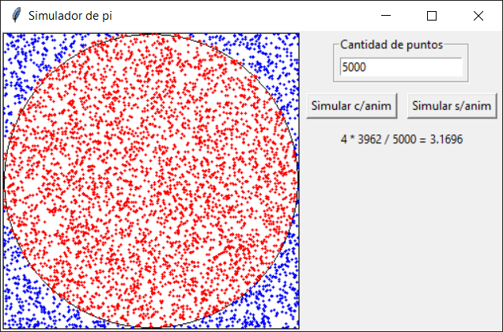

# Simulador de pi

El programa estima el valor de pi por medio de la generación de puntos (x, y) aleatorios siguiendo los pasos del método de Montecarlo.

Primero, se generan números aleatorios comprendidos dentro de las dimensiones del lienzo (canvas) donde se van a dibujar.

Esas coordenadas luego se ubican en el lienzo y se determina si están dentro o fuera del círculo que está inscripto dentro del rectángulo utilizando la fórmula `x^2 + y^2 = r^2`, como se ve en la imagen. Los que están dentro se pintan con color rojo y los que están fuera, con color azul.

Finalmente, se cuenta la cantidad de puntos que cayeron dentro del círculo, se divide ese número por la cantidad total de puntos generados y se multiplica el resultado por cuatro, obteniendo así una estimación del número pi.

Esta estimación surge de dividir el área del círculo por el área del cuadrado:

`Área del círculo / Área del cuadrado = PI*(r^2) / 4*(r^2)`

Podemos cancelar `(r^2)`, por lo que nos queda `PI / 4`.

Considerando que el conjunto de todos los puntos generados es el área del cuadrado y que el conjunto de puntos dentro del círculo es el área de dicha figura, obtenemos que:

`PI / 4 = cantidad de puntos dentro del círculo / cantidad de puntos dentro del cuadrado (cantidad total)`

Si multiplicamos ambos lados de la igualdad por cuatro, llegamos a que:

`PI = 4 * cantidad de puntos dentro del círculo / cantidad de puntos dentro del cuadrado (cantidad total)`

A medida que crece la cantidad de puntos generados, más se acerca el resultado al número pi.
